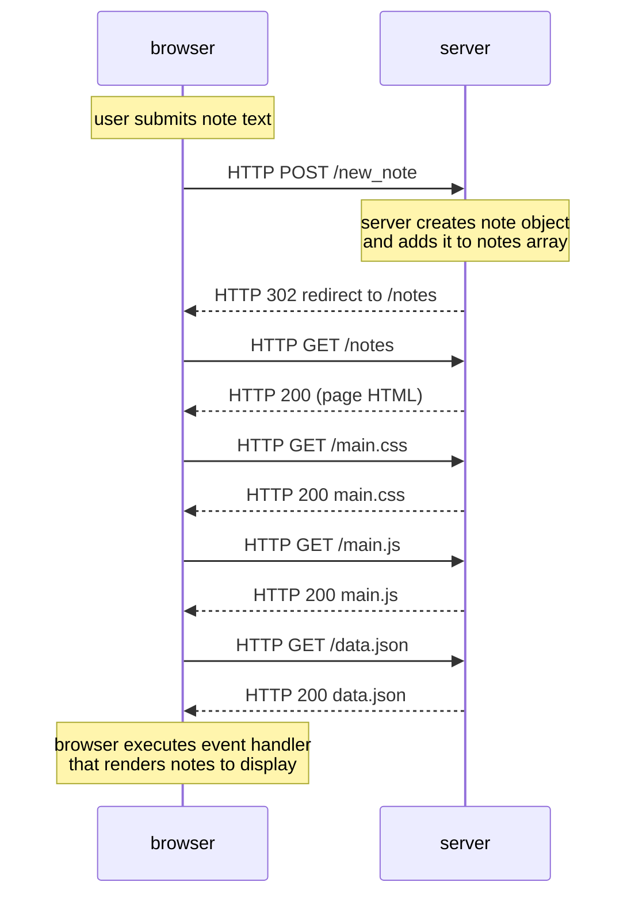

```mermaid
sequenceDiagram
note over browser: user submits note text
browser->>server: HTTP POST /new_note
note over server: server creates note object <br /> and adds it to notes array
server-->>browser: HTTP 302 redirect to /notes
browser->>server: HTTP GET /notes
server-->>browser: HTTP 200 (page HTML)
browser->>server: HTTP GET /main.css
server-->>browser: HTTP 200 main.css
browser->>server: HTTP GET /main.js
server-->>browser: HTTP 200 main.js
browser->>server: HTTP GET /data.json
server-->>browser: HTTP 200 data.json
note over browser: browser executes event handler <br /> that renders notes to display
```