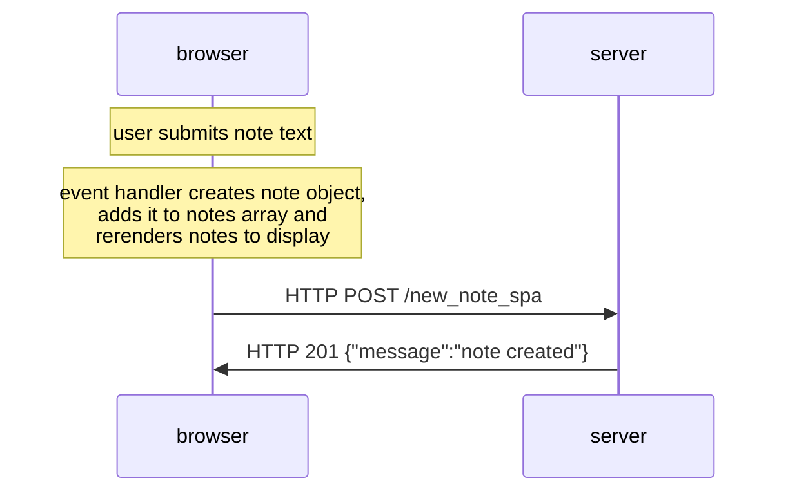

```mermaid
sequenceDiagram
note over browser: user submits note text
note over browser: event handler creates note object, <br /> adds it to notes array and <br /> rerenders notes to display
browser->>server: HTTP POST /new_note_spa
server->>browser: HTTP 201 {"message":"note created"}
```