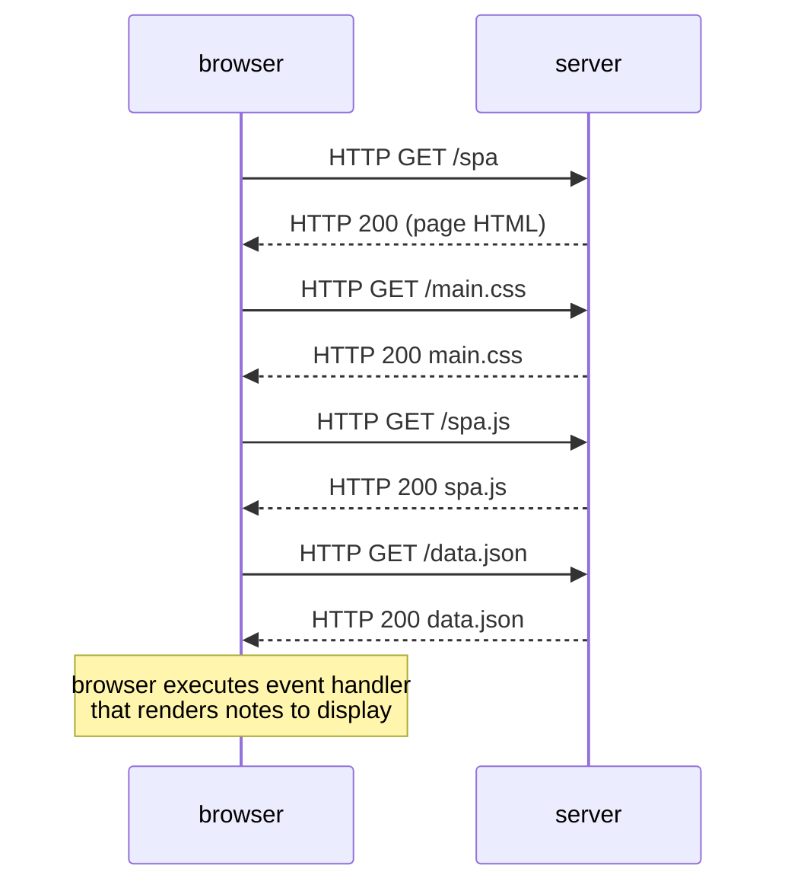

```mermaid
sequenceDiagram
browser->>server: HTTP GET /spa
server-->>browser: HTTP 200 (page HTML)
browser->>server: HTTP GET /main.css
server-->>browser: HTTP 200 main.css
browser->>server: HTTP GET /spa.js
server-->>browser: HTTP 200 spa.js
browser->>server: HTTP GET /data.json
server-->>browser: HTTP 200 data.json
note over browser: browser executes event handler <br /> that renders notes to display
```